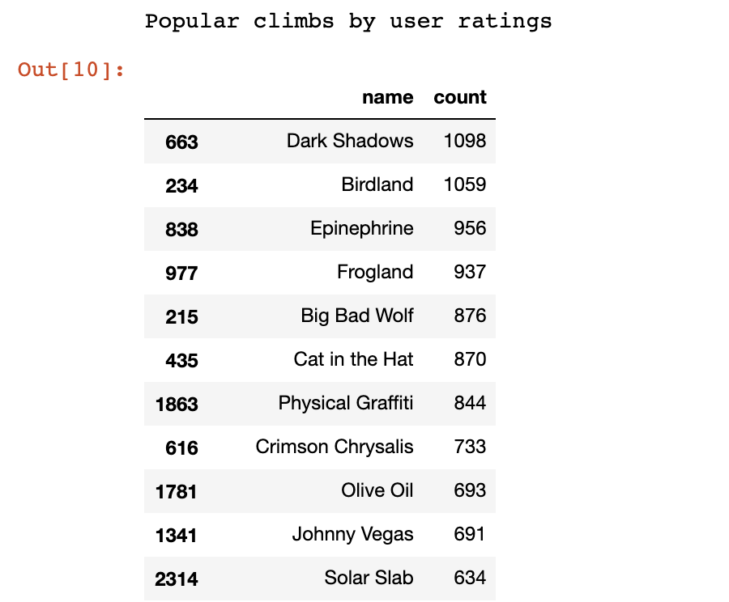
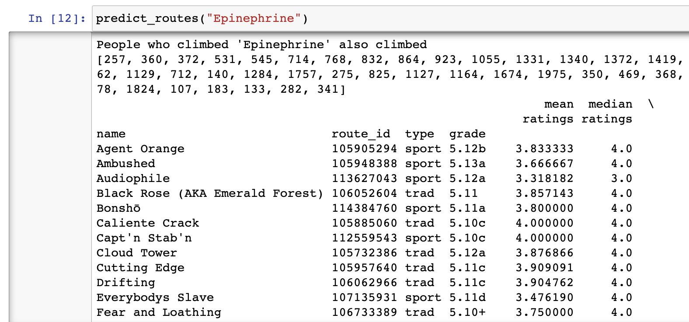

## Climb recommendation system in Python

How to build a climb recommendation system using Collaborative Filtering with [Surprise library](http://surpriselib.com/).  
We'll attempt to answer the question "climbers who climbed X also climbed Y".

Red Rocks Canyon (Nevada, USA) user-ratings dataset included in this tutorial was extracted from MountainProject.  Watch [climbing-data](https://github.com/OpenBeta/climbing-data) repo for updates.

### Setup your environment

Our Python examples are tested with Python 3.7 and pipenv.


### Install Jupyter notebook and Python dependencies
```python
# clone this repo
git clone https://github.com/OpenBeta/openbeta-tutorials

cd openbeta-tutorials/climb-recommendation-system

# install dependencies
pipenv install --skip-lock

# start jupyter notebook
pipenv jupyter notebook
```

---

Popular climbs by user ratings


Prediction for Epinephrine

