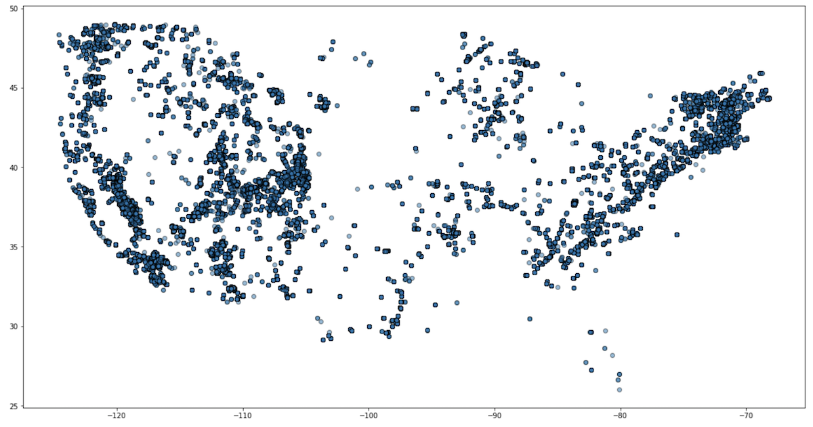

## Pandas 101: Make a simple climbing map

1.  How to load our USA routes dataset into a Pandas dataframe
2.  Create a simple map with GeoPandas

### Setup your environment

- Our Python examples are tested with Python 3.7 and pipenv
- Download the **climbing-data** repo 

```
git clone https://github.com/OpenBeta/climbing-data 
```

### Install Jupyter notebook and  Python dependencies
```python
git clone https://github.com/OpenBeta/openbeta-tutorials
cd openbeta-tutorials/pandas-101-climbing-map
pipenv install --skip-lock
pipenv jupyter notebook
```

